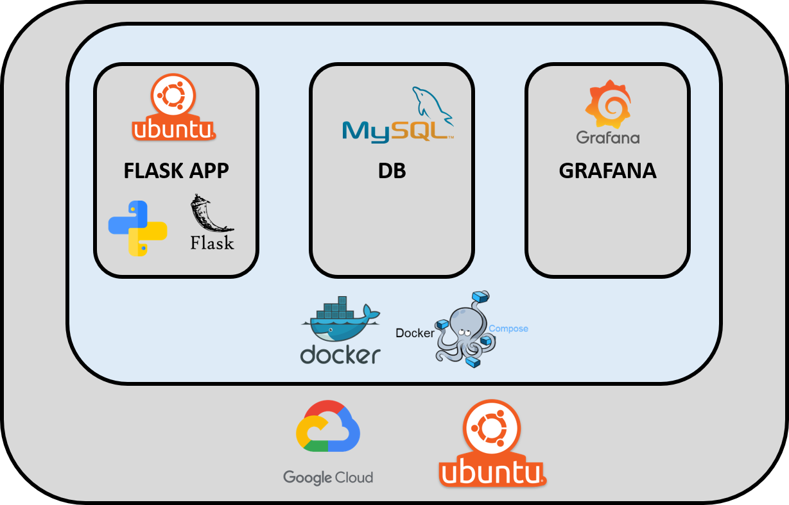

# DOCKER
La estructura de productivización de la app es:

Esta carpeta contiene:

- __docker-compose.yml__

	Fichero donde se definen los distintos servicios que se van a levantar como parte del sistema.
	  
- __grafana__

	Contiene la información provisionada del grafana en provisioning: datasources y dashboards
	  
- __db__

   	Contiene el dump de la base de datos que queremos representar (tfm.sql)
	  
- __app__

    Contiene DockerFile para la aplicación de Flask/Python y el requirements.txt de las librerías de Python de la app.
	  
- __Deployment__

    Contiene información sobre cómo desplegar nuestro proyecto con docker en GCP y en la VM (con la app en local), además de los scripts de bash de despliegue (install_docker.sh y prepare_app.sh).