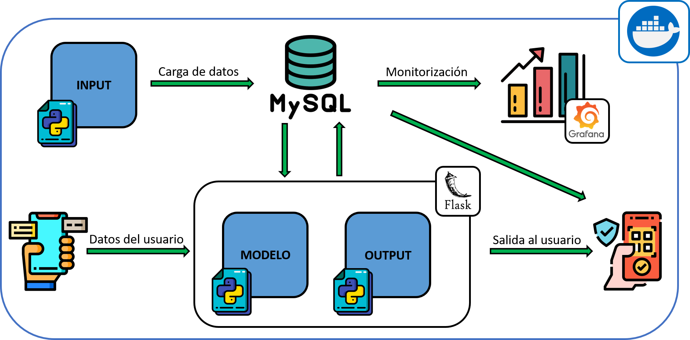

# TFM

Este repositorio contiene todo lo relativo a la App para el calculo de rutas para vehículos eléctricos, en el contexto del TFM del Master Big Data & Business Analitics de la UCM.
Los colaboradores principales de este repositorio son:
- Blanca Alonso
- Irene Robles Cabezas
- Marta García Palomo
- Lucía Tomaino de la Cruz

Existen varias carpetas:

	__Dataset__ 
	  Esta carpeta contiene los datasets que se van a utilizar, tanto es su formato original como tras haber sido limpiados y filtrados.

	__Docker__ 
	  Esta carpeta contiene los ficheros docker-compose.yml, DockerFile y todos los demás que son necesarios para productivizar el modelo
	  utilizando Docker y Docker-Compose. Además, hay información sobre como desplegar en Google Cloud Platform.

	__Documentacion__ 
	  Esta carpeta contiene ficheros con información relevante para el planteamiento del problema, fuentes de datos, etc.

	__ElectricRoute__ 
      (Herramienta web) Esta carpeta incluye el script de python para ejecutarla, los distintos ficheros .html, .js y .css necesarios y
	  las imágenes que se utilicen para el desarrollo de la herramienta.

	__Python__ 
	  Esta carpeta contiene scripts y otro tipo de ficheros (.json para configuración por ejemplo) relacionados con el desarrollo de la aplicación.
